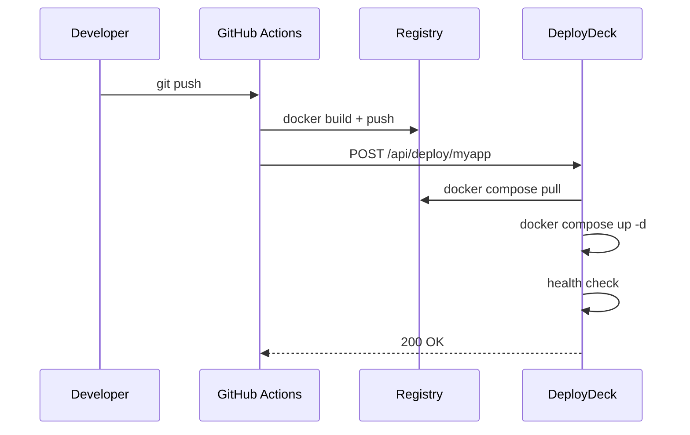
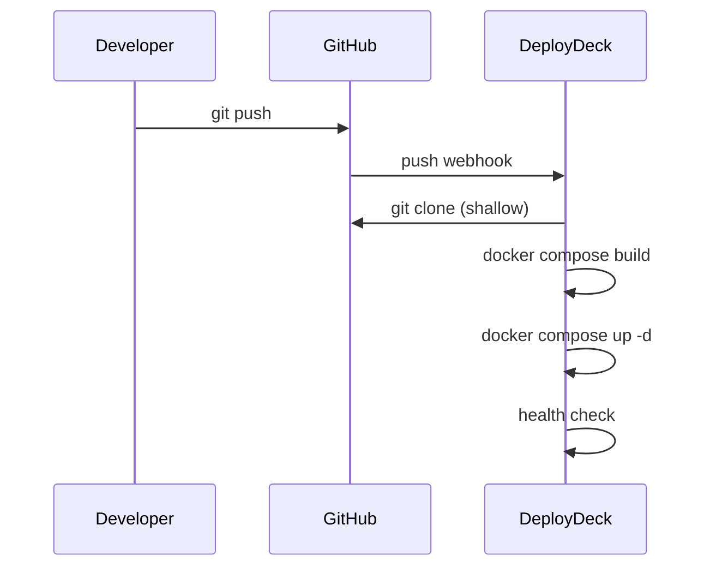
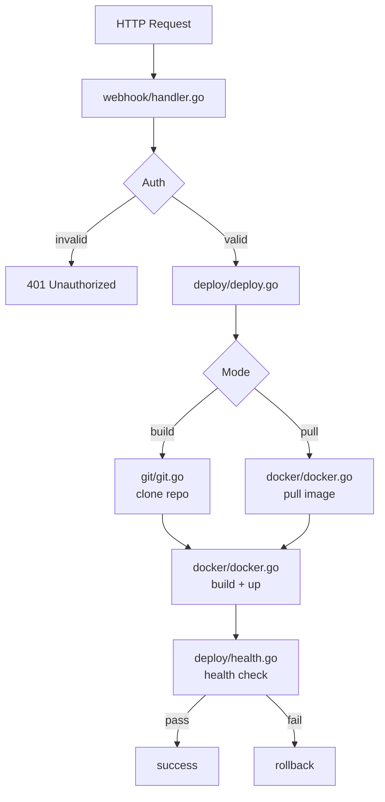

# DeployDeck

Your container deployment command center. Deploy on push. No polling. No complexity.

[](https://github.com/esteban-ams/deploydeck/actions/workflows/build.yml)
[](https://go.dev/)
[](https://opensource.org/licenses/MIT)

## The Problem

When you push code, your CI/CD builds a Docker image and pushes it to a registry. But how do you tell your server to pull the new image?

| Option | Problem |
|--------|---------|
| SSH manually | Log in every time |
| SSH from CI/CD | Exposes server IP and SSH keys |
| Watchtower | Polls every X minutes, not instant |
| Coolify/Portainer | Overkill for simple deployments |

## The Solution

DeployDeck runs on your server and listens for webhooks. It supports two deployment modes:

**Pull Mode** — Your CI/CD builds the image, pushes to a registry, then calls DeployDeck:



**Build Mode** — DeployDeck receives a push webhook, clones the repo, and builds on the server:



## Features

- **Two deploy modes**: Pull pre-built images or build from source
- **Webhook auth**: HMAC-SHA256 (GitHub), token (GitLab), shared secret (DeployDeck)
- **Health checks**: Configurable timeout, interval, and retries
- **Automatic rollback**: Image tagging snapshots before each deploy; restores on failure (manual rollback via `deploydeck rollback` too)
- **Branch filtering**: Only deploy pushes to the configured branch (build mode)
- **Per-service timeouts**: Default 5m (pull) or 10m (build), configurable
- **Token security**: Read tokens from files (Docker Secrets), env vars, or config
- **Auto-prune**: Clean Docker build cache after successful builds
- **Async deployments**: Per-service serialization, different services deploy concurrently
- **CLI client**: `deploydeck deploy/status/logs/rollback/config` — no hand-written `curl` needed
- **Setup wizard**: `deploydeck init` scaffolds `config.yaml` and prints a ready CI snippet
- **Persistent history**: Optional SQLite-backed deployment log (`storage.db_path`), in-memory by default
- **Notifications**: Slack, Discord, or generic webhook on deploy success/failure/rollback
- **Embedded dashboard**: Live deployment status at `/dashboard/`
- **Rate limiting & IP whitelisting**: Per-IP token bucket and CIDR allowlist on the deploy/rollback endpoints

## Install

```bash
curl -sSL https://raw.githubusercontent.com/esteban-ams/deploydeck/main/install.sh | bash
```

Supports Linux (amd64, arm64) and macOS (amd64, arm64). Installs to `/usr/local/bin/deploydeck`.

## Quick Start (Pull Mode)

### 1. Download and check your environment

```bash
curl -L https://github.com/esteban-ams/deploydeck/releases/latest/download/deploydeck-linux-amd64 -o deploydeck
chmod +x deploydeck
./deploydeck doctor   # checks Docker, Compose, Git, and config.yaml
```

### 2. Scaffold config.yaml

```bash
./deploydeck init --service myapp --compose-file /opt/apps/docker-compose.yml
```

Prompts for the service name inside the compose file and an optional health check URL, generates a random webhook secret (`auth.webhook_secret`), writes `config.yaml`, and prints a ready-to-paste CI/CD snippet for that exact service. Pass `--yes` together with `--service`/`--compose-file` to skip the prompts and run non-interactively. See `./deploydeck init --help` for every flag (`--mode`, `--health-url`, `--public-url`, `--ci github|gitlab|none`, ...).

### 3. Run

```bash
./deploydeck --config config.yaml
```

### 4. Trigger from CI/CD

`deploydeck init` already printed the exact step for your service and secret. For reference, the underlying call is a single authenticated POST:

**GitHub Actions:**
```yaml
- name: Deploy
  run: |
    curl -X POST https://deploy.yourdomain.com/api/deploy/myapp \
      -H "X-DeployDeck-Secret: ${{ secrets.DEPLOYDECK_SECRET }}" \
      -H "Content-Type: application/json" \
      -d '{"image": "ghcr.io/user/myapp:latest"}'
```

**GitLab CI:**
```yaml
deploy:
  script:
    - |
      curl -X POST https://deploy.yourdomain.com/api/deploy/myapp \
        -H "X-GitLab-Token: $DEPLOYDECK_SECRET" \
        -H "Content-Type: application/json" \
        -d '{"image": "registry.gitlab.com/user/myapp:latest"}'
```

### Operate day to day

The same binary is also a client for the running server — no need to hand-write `curl` for manual operations:

```bash
deploydeck deploy myapp --image ghcr.io/user/myapp --tag v1.2.3   # trigger a deploy
deploydeck status                                                  # latest state per service
deploydeck logs myapp -f                                           # tail a deployment
deploydeck rollback myapp                                          # roll back manually
```

Point these at a remote server with `-s https://deploy.yourdomain.com --secret $DEPLOYDECK_SECRET`, or export `DEPLOYDECK_SERVER`/`DEPLOYDECK_SECRET` once.

## Quick Start (Build Mode)

Build mode clones your repo and builds the image directly on the server. No registry needed.

### 1. Scaffold config.yaml

```bash
./deploydeck init --service myapp --compose-file docker-compose.yml --mode build --branch main
```

`init` asks for the branch to deploy on push and prints the exact webhook settings to add below, along with a freshly generated secret.

### 2. Set up GitHub Webhook

In your GitHub repo: **Settings > Webhooks > Add webhook**

- **Payload URL**: `https://deploy.yourdomain.com/api/deploy/myapp`
- **Content type**: `application/json`
- **Secret**: Your `webhook_secret`
- **Events**: Just the push event

Now every push to `main` triggers a build and deploy automatically.

## API Reference

### POST /api/deploy/:service

Trigger a deployment. Requires authentication header.

**Headers** (use one):
- `X-Hub-Signature-256: sha256=<hmac>` (GitHub)
- `X-GitLab-Token: <secret>` (GitLab)
- `X-DeployDeck-Secret: <secret>` (DeployDeck)

**Body (pull mode):**
```json
{"image": "ghcr.io/user/app:latest", "tag": "v1.2.3"}
```

**Body (build mode):** GitHub/GitLab push webhook payload (automatic).

**Response:**
```json
{"status": "pending", "deployment_id": "dep_123", "service": "myapp"}
```

**Response (branch filtered, build mode):**
```json
{"status": "skipped", "reason": "push to develop, expected main"}
```

### GET /api/deployments

List all deployments. SQLite-backed (persists across restarts) when `storage.db_path` is set; otherwise in-memory only.

```json
{
  "deployments": [
    {
      "id": "dep_123",
      "service": "myapp",
      "status": "success",
      "mode": "pull",
      "image": "ghcr.io/user/app:latest",
      "rollback_tag": "myapp:rollback-1707750000",
      "started_at": "2026-02-12T10:00:00Z",
      "completed_at": "2026-02-12T10:01:15Z"
    }
  ]
}
```

Deployment statuses: `pending`, `running`, `success`, `failed`, `rolled_back`.

### POST /api/rollback/:service

Roll the service back to its last tagged snapshot. Requires the same authentication as `/api/deploy/:service`. Fails with 404 if no rollback tag exists yet (i.e. the service has never deployed successfully with rollback enabled).

**Response:**
```json
{"status": "success", "deployment_id": "dep_124", "service": "myapp", "message": "rolled back to myapp:rollback-1707750000"}
```

### GET /api/deployments/:id/logs

Log lines for a single deployment, polled by `deploydeck logs -f`.

```json
{"deployment_id": "dep_123", "service": "myapp", "status": "success", "logs": ["pulling image...", "starting container...", "health check passed"]}
```

### GET /api/health

```json
{"status": "healthy", "version": "0.3.0", "uptime": "48h30m"}
```

### GET /dashboard/

Embedded web dashboard showing live deployment status. Enable with `dashboard.enabled: true`.

## Configuration Reference

```yaml
server:
  port: 9000                          # default: 9000
  host: "0.0.0.0"                     # default: 0.0.0.0
  tls:
    enabled: false
    cert_file: "/path/to/cert.pem"
    key_file: "/path/to/key.pem"

auth:
  webhook_secret: "your-secret"       # REQUIRED

rate_limit:                           # limits /api/deploy and /api/rollback per IP
  enabled: true                       # default: true
  requests_per_minute: 10             # default: 10
  burst_size: 5                       # default: 5

dashboard:
  enabled: false                      # serve the embedded dashboard at /dashboard/
  username: "admin"
  password: "change-me"

logging:
  level: "info"                       # debug, info, warn, error
  format: "text"                      # json, text

storage:
  db_path: ""                         # SQLite file path; empty = in-memory (history lost on restart)

notifications:                        # fired on deployment success/failure/rollback
  on_failure: true                    # default: true
  on_rollback: true                   # default: true
  # on_success: false                 # default: false
  # slack:
  #   webhook_url: "https://hooks.slack.com/services/..."
  # discord:
  #   webhook_url: "https://discord.com/api/webhooks/..."
  # webhook:
  #   url: "https://example.com/hooks/deploydeck"

services:
  myapp:
    # Required
    compose_file: "/opt/apps/docker-compose.yml"
    service_name: "myapp"

    # Deploy mode
    mode: "pull"                      # "pull" (default) or "build"
    working_dir: "/opt/apps"          # working directory for compose commands

    # Build mode options
    branch: "main"                    # only deploy pushes to this branch (default: main)
    repo: "https://github.com/u/r"   # fallback clone URL if webhook lacks it
    clone_token: ""                   # auth token for private repos
    clone_token_file: ""              # read token from file (Docker Secrets)
    prune_after_build: false          # clean build cache after deploy

    # Timeouts
    timeout: 5m                       # default: 5m (pull), 10m (build)

    # Health check
    health_check:
      enabled: true
      url: "http://localhost:8080/health"
      timeout: 30s                    # total health check timeout
      interval: 2s                    # time between checks
      retries: 10                     # max attempts

    # Rollback
    rollback:
      enabled: true
      keep_images: 3                  # rollback snapshots to keep

    # Environment variables passed to docker compose
    env:
      DEPLOY_ENV: "production"
```

## Environment Variables

Environment variables override config file values:

| Variable | Overrides | Example |
|----------|-----------|---------|
| `DEPLOYDECK_PORT` | `server.port` | `9000` |
| `DEPLOYDECK_HOST` | `server.host` | `0.0.0.0` |
| `DEPLOYDECK_WEBHOOK_SECRET` | `auth.webhook_secret` | `abc123...` |
| `DEPLOYDECK_LOG_LEVEL` | `logging.level` | `debug` |
| `DEPLOYDECK_CLONE_TOKEN` | `clone_token` (all services) | `ghp_xxx...` |
| `DEPLOYDECK_RATE_LIMIT_RPM` | `rate_limit.requests_per_minute` | `10` |
| `DEPLOYDECK_RATE_LIMIT_BURST` | `rate_limit.burst_size` | `5` |
| `DEPLOYDECK_DB_PATH` | `storage.db_path` | `/var/lib/deploydeck/deployments.db` |

The CLI client (`deploy`, `rollback`, `status`, `logs`, `config`, `init`) reads two more, unrelated to the server config above:

| Variable | Sets | Example |
|----------|------|---------|
| `DEPLOYDECK_SERVER` | `--server`/`-s` default | `https://deploy.yourdomain.com` |
| `DEPLOYDECK_SECRET` | `--secret` default | `abc123...` |

**Precedence**: CLI flags > environment variables > config.yaml > defaults

## Docker Deployment

```yaml
# docker-compose.yml
services:
  deploydeck:
    image: ghcr.io/esteban-ams/deploydeck:latest
    container_name: deploydeck
    restart: unless-stopped
    ports:
      - "9000:9000"
    volumes:
      - ./config.yaml:/app/config.yaml:ro
      - /var/run/docker.sock:/var/run/docker.sock
    environment:
      - DEPLOYDECK_LOG_LEVEL=info
```

**Important:** DeployDeck needs access to the Docker socket to manage containers.

## Architecture

```
deploydeck/
├── cmd/deploydeck/
│   ├── main.go                  # Entry point
│   ├── root.go                  # Cobra root cmd, server bootstrap
│   ├── doctor.go                # `deploydeck doctor` — environment checks
│   ├── cmd_init.go              # `deploydeck init` — config.yaml + CI snippet wizard
│   ├── client.go                # Shared HTTP client for the CLI subcommands
│   ├── cmd_deploy.go            # `deploydeck deploy`
│   ├── cmd_rollback.go          # `deploydeck rollback`
│   ├── status.go                # `deploydeck status`
│   ├── cmd_logs.go              # `deploydeck logs`
│   └── cmd_config.go            # `deploydeck config`
├── internal/
│   ├── config/                  # YAML parsing, env overrides, validation
│   ├── webhook/                 # HTTP handlers, auth (GitHub/GitLab/DeployDeck), payload parsing
│   ├── deploy/                  # Deployment orchestration, rollback, state machine, health checks
│   ├── docker/                  # Docker Compose CLI wrapper (pull, build, up, tag)
│   ├── git/                     # Git clone with token injection (build mode)
│   ├── storage/                 # Deployment history: SQLite or in-memory
│   ├── notify/                  # Slack/Discord/webhook notifications on terminal state
│   ├── dashboard/               # Embedded web dashboard (served at /dashboard/)
│   ├── ratelimit/               # Per-IP token bucket for deploy/rollback endpoints
│   └── ipwhitelist/             # CIDR allowlist for deploy/rollback endpoints
├── config.example.yaml
├── Dockerfile
└── Makefile
```

**Request flow:**



## Security

### Authentication

Three methods supported (use one per request):

| Method | Header | Format |
|--------|--------|--------|
| GitHub | `X-Hub-Signature-256` | `sha256=<hmac-sha256>` |
| GitLab | `X-GitLab-Token` | Plain token string |
| DeployDeck | `X-DeployDeck-Secret` | Plain string or `sha256=<hmac>` |

All methods use constant-time comparison to prevent timing attacks.

### Token Security for Private Repos

Clone tokens for private repos (build mode) can be provided via:

1. `clone_token` in config (least secure)
2. `clone_token_file` pointing to a file (Docker Secrets pattern, recommended)
3. `DEPLOYDECK_CLONE_TOKEN` environment variable (fallback)

**Priority**: config value > file > env var

Token injection is automatic per provider:
- GitHub: `https://x-access-token:<token>@github.com/...`
- GitLab: `https://oauth2:<token>@gitlab.com/...`

### Network Security

- Run behind a reverse proxy (Traefik, nginx) with HTTPS
- Use strong, randomly generated secrets: `openssl rand -hex 32`
- DeployDeck requires Docker socket access (runs as root or docker group)

## Development

### Prerequisites

- Go 1.22+
- Docker and Docker Compose

### Build & Run

```bash
make build          # Build binary
make build-linux    # Cross-compile for Linux amd64
make run            # Run with go run
make test           # Run all tests
make deps           # Download and tidy dependencies
make clean          # Remove build artifacts
```

### Run from source

```bash
cp config.example.yaml config.yaml
# Edit config.yaml
go run ./cmd/deploydeck --config config.yaml
```

### Test webhook

```bash
./test-webhook.sh http://localhost:9000 your-secret
```

## Contributing

Contributions welcome! See [CONTRIBUTING.md](CONTRIBUTING.md) for guidelines.

## License

MIT License - see [LICENSE](LICENSE) for details.
